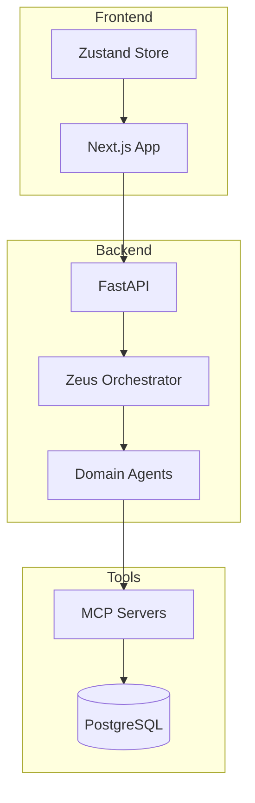

# Developer Onboarding

Welcome to the KOSMOS development team! This guide will help you set up your environment and understand the codebase.

## Day 1: Environment Setup

### 1. Clone and Configure

```bash
# Clone the repository
git clone https://github.com/nuvanta-holding/kosmos-dar.git
cd kosmos-dar

# Copy environment files
cp implementation/.env.example implementation/.env
cp implementation/frontend/.env.example implementation/frontend/.env.local
```

### 2. Install Dependencies

```bash
# Backend (Python)
cd implementation/backend
python -m venv venv
source venv/bin/activate  # Windows: venv\Scripts\activate
pip install -r requirements.txt

# Frontend (Node.js)
cd ../frontend
npm install

# MCP Servers (TypeScript)
cd ../mcp-servers
npm install
```

### 3. Start Development Services

```bash
# Start PostgreSQL and Redis (Docker)
docker-compose -f docker-compose.dev.yml up -d postgres redis

# Start backend
cd backend
uvicorn main:app --reload --port 8000

# Start frontend (new terminal)
cd frontend
npm run dev
```

### 4. Verify Setup

```bash
# Check backend health
curl http://localhost:8000/health

# Check frontend
open http://localhost:3000
```

## Day 2: Understanding the Codebase

### Project Structure

```
kosmos-dar/
├── implementation/
│   ├── backend/           # FastAPI backend
│   │   ├── agents/        # 11 specialized agents
│   │   ├── api/           # REST endpoints
│   │   ├── core/          # Core utilities
│   │   └── services/      # Business logic
│   ├── frontend/          # Next.js 14 app
│   │   ├── app/           # App router pages
│   │   ├── components/    # React components
│   │   └── stores/        # State management
│   └── mcp-servers/       # MCP tool servers
│       └── src/servers/   # 88 MCP implementations
├── docs-site/             # This documentation
└── scripts/               # Automation scripts
```

### Key Concepts

| Concept | Description | Location |
|---------|-------------|----------|
| **Agents** | AI agents with specific domains | `backend/agents/` |
| **MCP Servers** | Tool integrations (Model Context Protocol) | `mcp-servers/src/servers/` |
| **Zeus** | Master orchestrator routing requests | `backend/agents/zeus/` |
| **AEGIS** | Security guardian with veto power | `backend/agents/aegis/` |
| **Pentarchy** | 3-agent voting system | `backend/core/governance/` |

### Architecture Diagram



## Day 3: Making Your First Contribution

### 1. Create a Feature Branch

```bash
git checkout -b feature/your-feature-name
```

### 2. Code Standards

| Language | Formatter | Linter |
|----------|-----------|--------|
| Python | Black | Ruff |
| TypeScript | Prettier | ESLint |
| SQL | pg_format | - |

```bash
# Format Python
black .
ruff check --fix .

# Format TypeScript
npm run lint:fix
```

### 3. Testing

```bash
# Backend tests
cd backend
pytest tests/ -v

# Frontend tests
cd frontend
npm test

# E2E tests
npm run test:e2e
```

### 4. Commit Guidelines

Use conventional commits:

```bash
# Format: type(scope): description
git commit -m "feat(agents): add new capability to Hermes"
git commit -m "fix(api): resolve authentication timeout"
git commit -m "docs(readme): update installation steps"
```

| Type | Description |
|------|-------------|
| `feat` | New feature |
| `fix` | Bug fix |
| `docs` | Documentation |
| `refactor` | Code refactoring |
| `test` | Adding tests |
| `chore` | Maintenance |

### 5. Create Pull Request

```bash
git push -u origin feature/your-feature-name
# Then create PR on GitHub
```

## Development Tools

### Recommended VSCode Extensions

```json
{
  "recommendations": [
    "ms-python.python",
    "ms-python.black-formatter",
    "charliermarsh.ruff",
    "dbaeumer.vscode-eslint",
    "esbenp.prettier-vscode",
    "bradlc.vscode-tailwindcss",
    "prisma.prisma"
  ]
}
```

### Useful Commands

```bash
# Run all extractors (generate docs from code)
python scripts/docs/generate-all.py

# Start documentation site locally
cd docs-site && npm start

# Database migrations
cd backend && alembic upgrade head

# Generate TypeScript types from OpenAPI
npm run generate:types
```

## Getting Help

| Resource | Link |
|----------|------|
| **Documentation** | This site |
| **API Reference** | `/docs/04-api/` |
| **Agent Docs** | `/docs/agents/` |
| **MCP Servers** | `/docs/05-mcp-servers/` |
| **Team Chat** | Slack #kosmos-dev |

## Onboarding Checklist

- [ ] Clone repository and run locally
- [ ] Read Architecture Overview
- [ ] Explore an agent's code (start with Hermes)
- [ ] Explore an MCP server (start with database)
- [ ] Run the test suite
- [ ] Make a small documentation fix
- [ ] Create your first PR
- [ ] Get PR reviewed and merged
