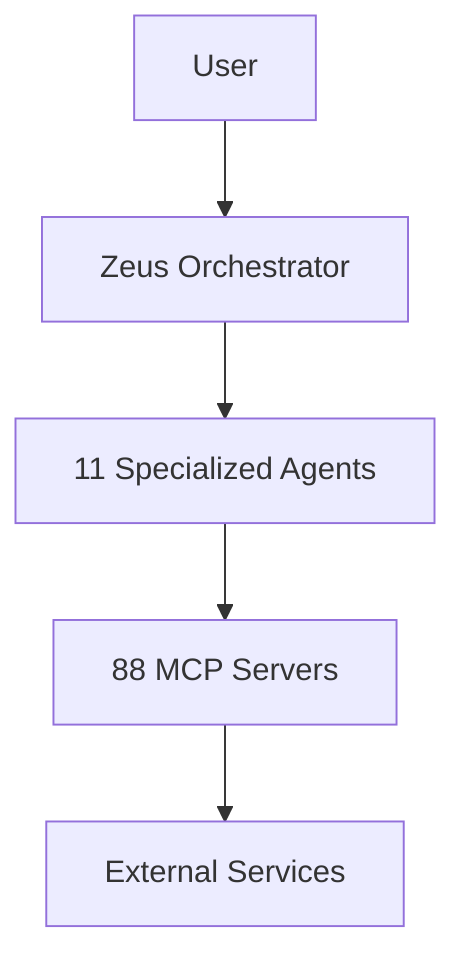

# Getting Started with KOSMOS V2.0

Welcome to KOSMOS V2.0! This guide will help you get up and running quickly.

## Prerequisites

Before you begin, ensure you have:

- **Docker** and **Docker Compose** installed
- **Node.js 20+** (for frontend development)
- **Python 3.11+** (for backend development)
- **PostgreSQL 16** (or use Docker)

## Quick Start

```bash
# Clone the repository
git clone https://github.com/nuvanta-holding/kosmos-dar.git
cd kosmos-dar/implementation

# Copy environment configuration
cp .env.example .env

# Start all services
docker-compose up -d
```

## What's Next?

- **[Developer Onboarding](./developer-onboarding)** - Full local/dev setup
- **[Search Setup](./search-setup)** - Typesense search configuration
- **[Contributing](./contributing)** - Development workflow

## Architecture Overview

KOSMOS V2.0 consists of:



For detailed architecture documentation, see the [Architecture](/docs/02-architecture/) section.
