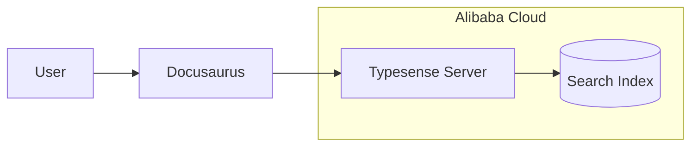

# Search Setup

KOSMOS documentation uses Typesense for AI-powered semantic search.

## Architecture



## Typesense Server Requirements

For a documentation site (~100-500 pages), minimal resources are sufficient:

| Resource | Docs Site | Large Scale |
|----------|-----------|-------------|
| vCPU | 1 | 4+ |
| RAM | 2 GB free | 16 GB+ |
| Storage | 10 GB | 50 GB+ |
| Network | 10 Mbps | 100 Mbps+ |

:::tip Shared Instance
Typesense can run on an existing instance alongside other services.
No dedicated server required for documentation search.
:::

## Deployment on Existing Alibaba Cloud Instance

### 1. Check Available Resources

```bash
# SSH into your existing instance
ssh root@<your-instance-ip>

# Check memory (need ~2GB free)
free -h

# Check storage (need ~10GB free)
df -h

# Check if port 8108 is available
netstat -tuln | grep 8108
```

### 2. Install Typesense

```bash
# SSH into the instance
ssh root@<instance-ip>

# Install Typesense
curl -O https://dl.typesense.org/releases/27.1/typesense-server-27.1-linux-amd64.tar.gz
tar -xzf typesense-server-27.1-linux-amd64.tar.gz

# Create data directory
mkdir -p /var/lib/typesense

# Generate API key
export TYPESENSE_API_KEY=$(openssl rand -hex 32)
echo "Admin Key: $TYPESENSE_API_KEY"

# Start Typesense
./typesense-server \
  --data-dir=/var/lib/typesense \
  --api-key=$TYPESENSE_API_KEY \
  --listen-port=8108 \
  --enable-cors
```

### 3. Configure as Systemd Service

```bash
# Create typesense user (runs with limited privileges)
useradd -r -s /bin/false typesense
chown -R typesense:typesense /var/lib/typesense /opt/typesense

# Store API key securely
echo "TYPESENSE_API_KEY=$TYPESENSE_API_KEY" > /etc/typesense.env
chmod 600 /etc/typesense.env

# Create systemd service
cat > /etc/systemd/system/typesense.service << 'EOF'
[Unit]
Description=Typesense Search Server
After=network.target

[Service]
Type=simple
User=typesense
EnvironmentFile=/etc/typesense.env
ExecStart=/opt/typesense/typesense-server \
  --data-dir=/var/lib/typesense \
  --api-key=${TYPESENSE_API_KEY} \
  --listen-port=8108 \
  --enable-cors
Restart=always
RestartSec=5
# Memory limit for shared instance (adjust as needed)
MemoryMax=1G

[Install]
WantedBy=multi-user.target
EOF

systemctl daemon-reload
systemctl enable typesense
systemctl start typesense

# Verify it's running
systemctl status typesense
curl http://localhost:8108/health
```

### 4. Configure Nginx Reverse Proxy

```nginx
server {
    listen 443 ssl http2;
    server_name search.nuvanta-holding.com;

    ssl_certificate /etc/letsencrypt/live/search.nuvanta-holding.com/fullchain.pem;
    ssl_certificate_key /etc/letsencrypt/live/search.nuvanta-holding.com/privkey.pem;

    location / {
        proxy_pass http://127.0.0.1:8108;
        proxy_set_header Host $host;
        proxy_set_header X-Real-IP $remote_addr;
        proxy_set_header X-Forwarded-For $proxy_add_x_forwarded_for;
        proxy_set_header X-Forwarded-Proto $scheme;
    }
}
```

## Create Search Collection

```bash
# Create the kosmos-docs collection
curl -X POST "https://search.nuvanta-holding.com/collections" \
  -H "X-TYPESENSE-API-KEY: ${TYPESENSE_ADMIN_KEY}" \
  -H "Content-Type: application/json" \
  -d '{
    "name": "kosmos-docs",
    "fields": [
      {"name": "title", "type": "string"},
      {"name": "content", "type": "string"},
      {"name": "description", "type": "string", "optional": true},
      {"name": "url", "type": "string"},
      {"name": "hierarchy.lvl0", "type": "string", "optional": true},
      {"name": "hierarchy.lvl1", "type": "string", "optional": true},
      {"name": "hierarchy.lvl2", "type": "string", "optional": true},
      {"name": "type", "type": "string", "facet": true}
    ],
    "default_sorting_field": ""
  }'
```

## Generate Search-Only API Key

```bash
# Create a search-only key for the frontend
curl -X POST "https://search.nuvanta-holding.com/keys" \
  -H "X-TYPESENSE-API-KEY: ${TYPESENSE_ADMIN_KEY}" \
  -H "Content-Type: application/json" \
  -d '{
    "description": "Search-only key for docs",
    "actions": ["documents:search"],
    "collections": ["kosmos-docs"]
  }'
```

## Configure GitHub Secrets

Add these secrets to your GitHub repository:

| Secret | Description |
|--------|-------------|
| `TYPESENSE_HOST` | `search.nuvanta-holding.com` |
| `TYPESENSE_PORT` | `443` |
| `TYPESENSE_PROTOCOL` | `https` |
| `TYPESENSE_SEARCH_API_KEY` | Search-only API key |
| `TYPESENSE_ADMIN_API_KEY` | Admin key (for indexing) |

## Index Documentation

The documentation is indexed automatically during CI/CD:

```yaml
# .github/workflows/docs.yml
- name: Index to Typesense
  if: env.TYPESENSE_HOST
  run: |
    npx docusaurus-typesense-scraper \
      --config typesense.config.json
  env:
    TYPESENSE_HOST: ${{ secrets.TYPESENSE_HOST }}
    TYPESENSE_API_KEY: ${{ secrets.TYPESENSE_ADMIN_API_KEY }}
```

## Local Development

For local development without Typesense:

```bash
# Start without search
npm start
```

With local Typesense:

```bash
# Run Typesense in Docker
docker run -d \
  -p 8108:8108 \
  -v /tmp/typesense-data:/data \
  typesense/typesense:27.1 \
  --data-dir=/data \
  --api-key=xyz \
  --enable-cors

# Set environment variables
export TYPESENSE_HOST=localhost
export TYPESENSE_PORT=8108
export TYPESENSE_PROTOCOL=http
export TYPESENSE_SEARCH_API_KEY=xyz

# Start with search
npm start
```

## Monitoring

Monitor Typesense health:

```bash
# Health check
curl "https://search.nuvanta-holding.com/health"

# Metrics
curl "https://search.nuvanta-holding.com/metrics.json" \
  -H "X-TYPESENSE-API-KEY: ${TYPESENSE_ADMIN_KEY}"

# Collection stats
curl "https://search.nuvanta-holding.com/collections/kosmos-docs" \
  -H "X-TYPESENSE-API-KEY: ${TYPESENSE_ADMIN_KEY}"
```
