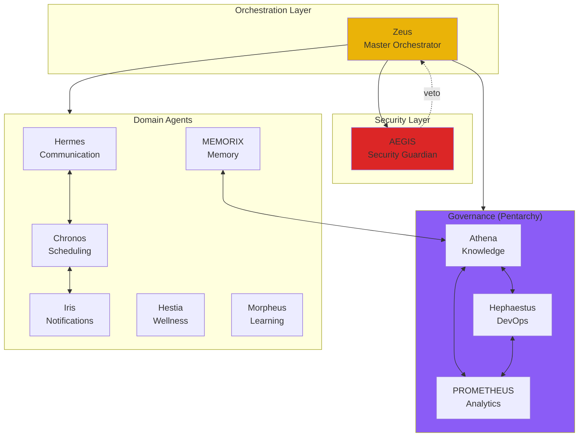
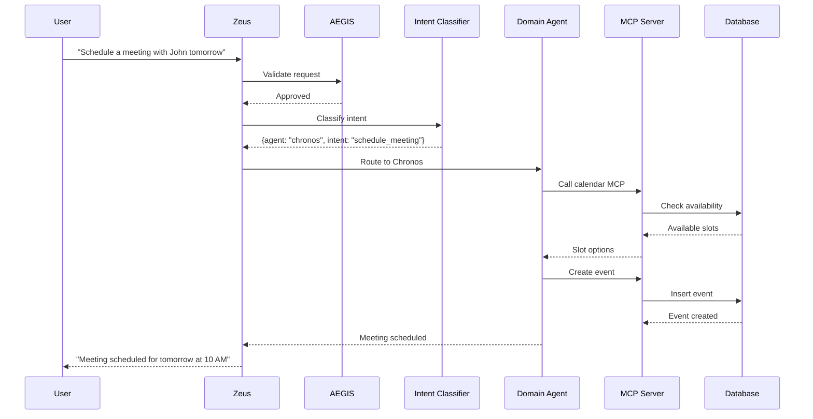
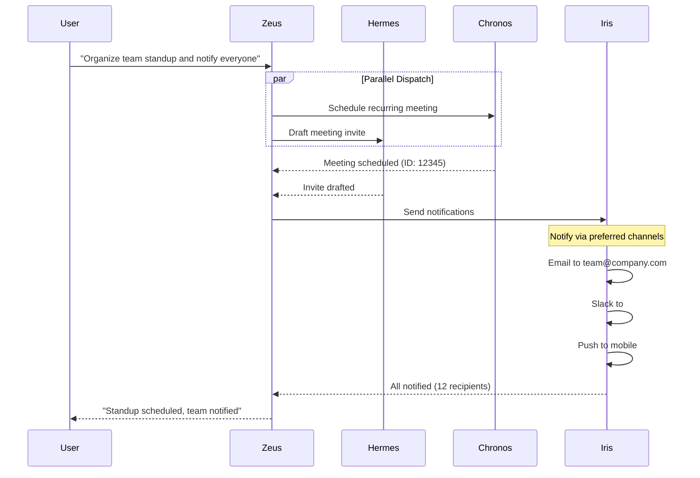
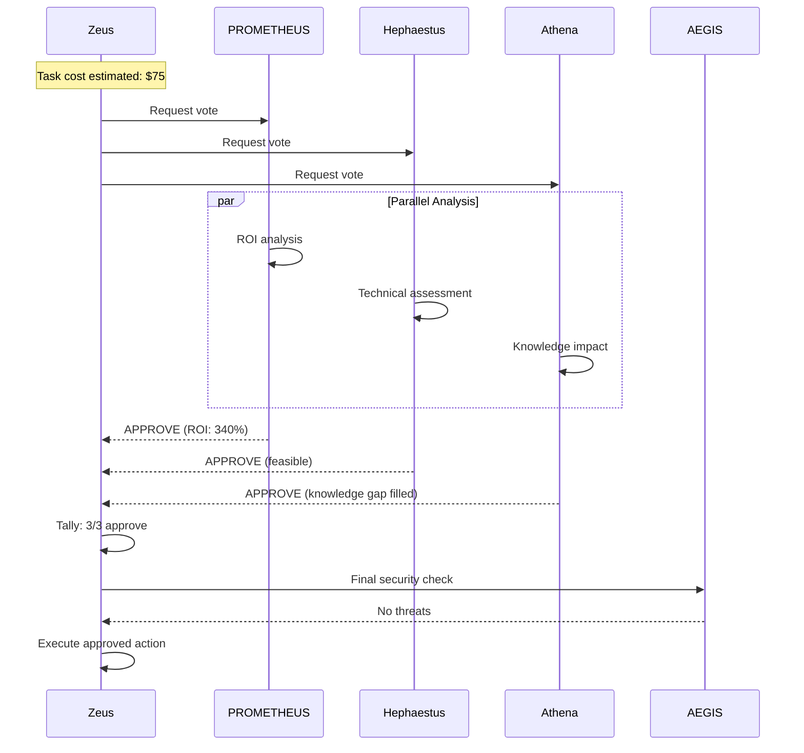
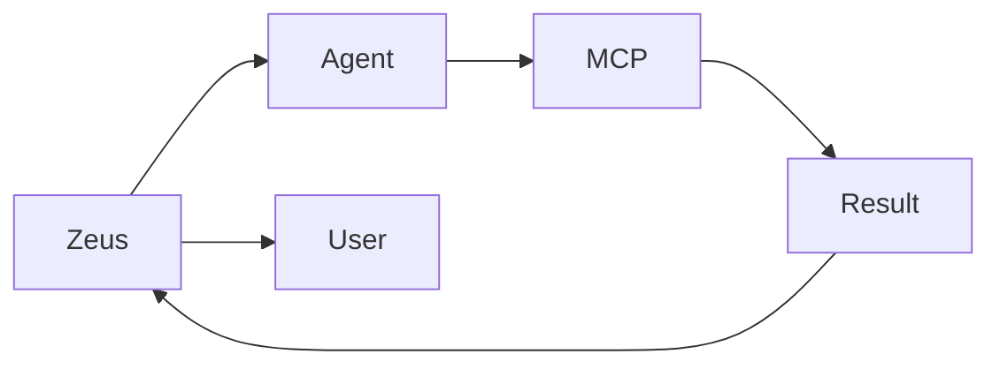
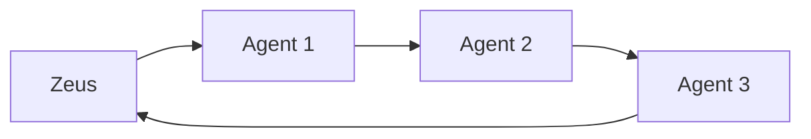
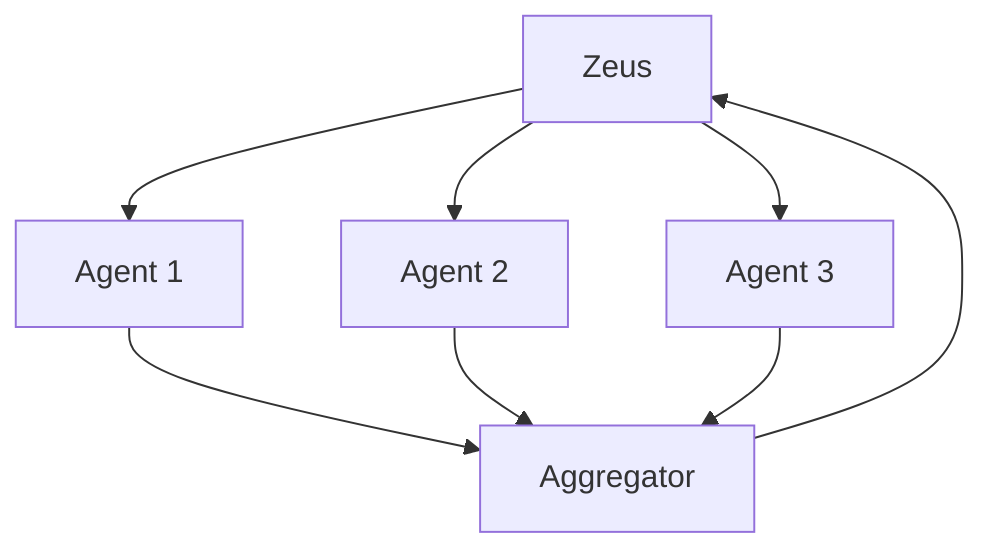
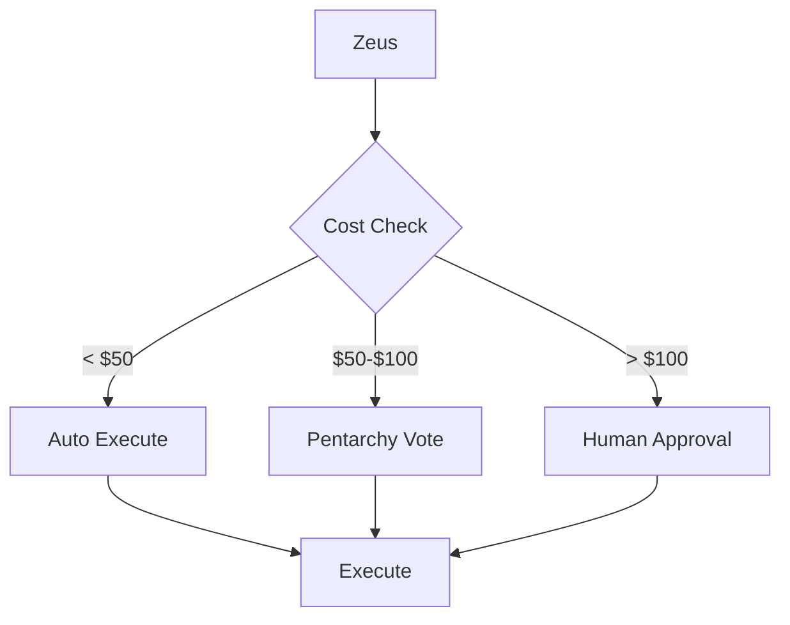
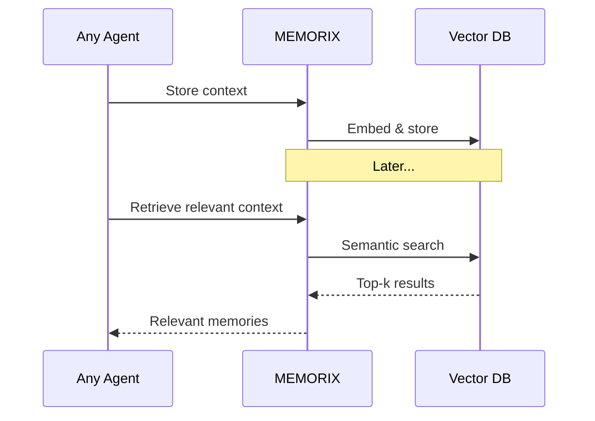
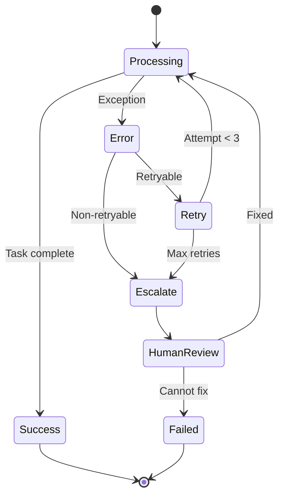

# Agent Interactions

How KOSMOS agents communicate, collaborate, and delegate tasks.

## Agent Communication Model

## Request Lifecycle

## Multi-Agent Collaboration

When tasks require multiple agents to collaborate:

## Pentarchy Voting Flow

## Agent Delegation Patterns

### 1. Direct Delegation

Zeus routes directly to a single agent:

### 2. Sequential Chain

Tasks processed in order:

### 3. Parallel Fan-Out

Multiple agents work simultaneously:

### 4. Conditional Routing

Based on context or cost:

## Agent Memory Sharing

MEMORIX provides shared memory across agents:

## Error Handling & Recovery

## Agent Capabilities Matrix

| Agent | Can Initiate | Can Delegate | Voting Power | Veto Power |
|-------|--------------|--------------|--------------|------------|
| **Zeus** | Yes | Yes | No | No |
| **AEGIS** | No | No | No | **Yes** |
| **PROMETHEUS** | No | Yes | Yes | No |
| **Hephaestus** | No | Yes | Yes | No |
| **Athena** | No | Yes | Yes | No |
| **Hermes** | No | No | No | No |
| **Chronos** | No | No | No | No |
| **Iris** | No | No | No | No |
| **MEMORIX** | No | No | No | No |
| **Hestia** | No | No | No | No |
| **Morpheus** | No | No | No | No |
