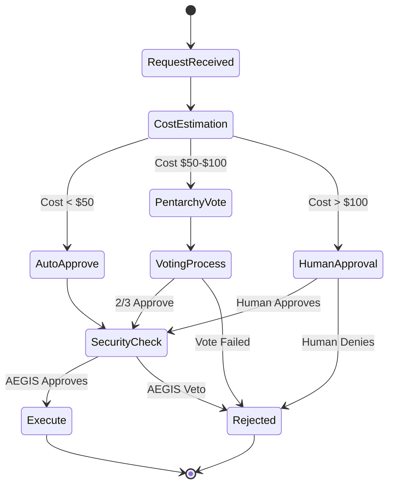
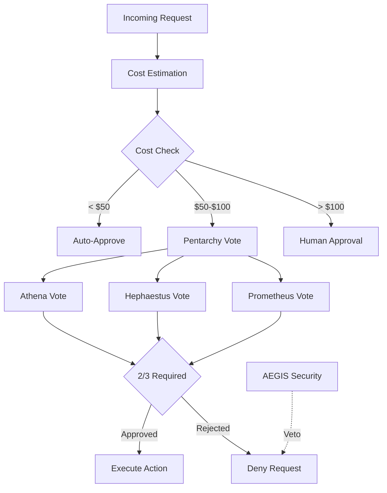
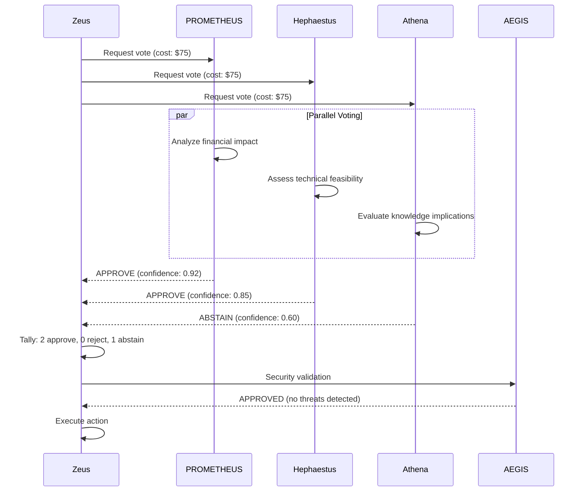

# Governance Framework

KOSMOS V2.0 implements a sophisticated governance system with automated decision-making and human oversight.

## Decision Flow Overview



## Pentarchy System

The Pentarchy is a 3-agent voting system for medium-stakes decisions ($50-$100):



### Voting Members

| Agent | Domain | Voting Role |
|-------|--------|-------------|
| **Nur PROMETHEUS** | Analytics | Lead voter - financial implications |
| **Hephaestus** | DevOps | Technical feasibility |
| **Athena** | Knowledge | Analytical impact |

### Vote Decisions

```python
class VoteDecision(Enum):
    APPROVE = "approve"      # Proceed with action
    REJECT = "reject"        # Deny the action
    ABSTAIN = "abstain"      # No opinion
    DEFER_TO_HUMAN = "defer" # Escalate to human
```

### Cost Thresholds

| Threshold | Cost Range | Decision Method | Timeout |
|-----------|------------|-----------------|---------|
| Auto-Approve | &lt;$50 | Automatic | Instant |
| Pentarchy | $50-$100 | 3-agent vote (2/3 required) | 30 seconds |
| Human Required | &gt;$100 | Human approval | Varies |

### Voting Sequence



## Security Veto

AEGIS has special veto power over any decision:

```yaml
security_veto:
  agent: "aegis"
  veto_power: true
  veto_reasons:
    - security_risk
    - data_breach_potential
    - compliance_violation
    - pii_exposure
```

When AEGIS vetoes, the action is blocked regardless of Pentarchy vote outcome.

## Kill-Switch Protocol

Three-level emergency shutdown capability:

### Level 1: Agent Level
- **Trigger**: Single agent anomaly
- **Action**: Isolate the affected agent
- **Authority**: Security team, AEGIS
- **Recovery**: Manual restart with review

### Level 2: Subsystem Level
- **Trigger**: Multiple agent anomaly
- **Action**: Isolate the affected subsystem
- **Authority**: Security lead, Engineering lead
- **Recovery**: Incident review required

### Level 3: System Level
- **Trigger**: Critical security event
- **Action**: Full system shutdown
- **Authority**: CISO, CTO, CEO
- **Recovery**: Full audit required

### Automatic Triggers

```yaml
automatic_triggers:
  - condition: "error_rate > 50%"
    level: "agent_level"
  - condition: "data_breach_detected"
    level: "subsystem_level"
  - condition: "prompt_injection_attack"
    level: "agent_level"
  - condition: "unauthorized_data_access"
    level: "system_level"
```

## RACI Matrix

| Activity | Zeus | Agents | Security | Human Ops | Management |
|----------|------|--------|----------|-----------|------------|
| Task Routing | **R** | I | C | I | I |
| Tool Execution | A | **R** | C | I | I |
| Security Decisions | C | I | **R** | A | I |
| Cost &gt; $100 | I | I | C | **R** | A |
| System Shutdown | I | I | C | **R** | A |
| Model Updates | A | I | C | **R** | A |
| Incident Response | C | C | **R** | A | I |

*R = Responsible, A = Accountable, C = Consulted, I = Informed*

## Progressive Autonomy

As trust is established, autonomy increases:

```yaml
autonomy_evolution:
  phase_1: "Agents Propose → Humans Approve"
  phase_2: "Agents Execute Routine → Humans Approve Critical"
  phase_3: "Agents Self-Optimize → Humans Guide Evolution"
  phase_4: "Autonomous Operations → Human Strategic Oversight"

triggers_for_increased_autonomy:
  - task_success_rate: ">95%"
  - human_override_rate: "<5%"
  - compliance_adherence: "100%"
  - cost_accuracy: "±10%"
```

## Human Override

Even with maximum autonomy, humans retain:

1. **Kill Switch** - Immediate system halt capability
2. **Override Authority** - Reverse any agent decision
3. **Audit Access** - Complete visibility into all actions
4. **Configuration Control** - Define autonomy boundaries
