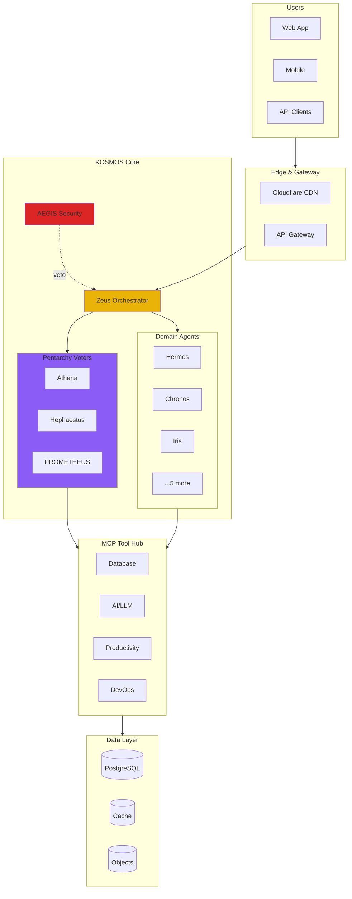
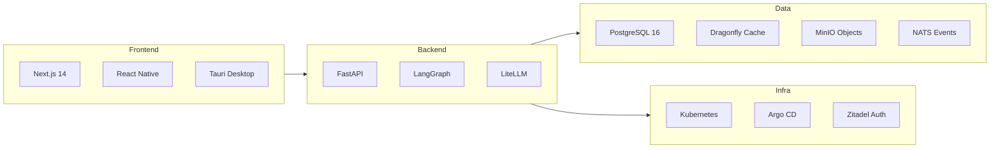

# KOSMOS V2.0 Architecture

KOSMOS is an **AI-Native Enterprise Operating System** built on a multi-agent architecture with 11 specialized agents, 88 MCP tool servers, and enterprise-grade governance.

## Design Principles

| Principle | Description |
|-----------|-------------|
| **Agent-First** | Every capability is an agent with tools, not monolithic code |
| **Cost-Aware** | Built-in governance for LLM spend ($50 auto, $50-100 vote, $100+ human) |
| **Security-First** | AEGIS has veto power over all actions |
| **Observable** | Full tracing from user request to tool execution |
| **Cloud-Native** | Kubernetes-native, GitOps deployment |

## High-Level Architecture



## Request Flow

```mermaid
sequenceDiagram
    participant U as User
    participant Z as Zeus
    participant A as AEGIS
    participant P as Pentarchy
    participant Ag as Agent
    participant M as MCP Tool
    participant D as Database

    U->>Z: Send request
    Z->>A: Security check
    A-->>Z: Approved

    alt Cost &lt; $50
        Z->>Ag: Route to agent
    else Cost $50-$100
        Z->>P: Request vote
        P-->>Z: 2/3 approve
        Z->>Ag: Route to agent
    else Cost &gt; $100
        Z->>U: Request human approval
    end

    Ag->>M: Call tool
    M->>D: Query/Update
    D-->>M: Result
    M-->>Ag: Tool result
    Ag-->>Z: Response
    Z-->>U: Final response
```

## Key Components

| Component | Description | Docs |
|-----------|-------------|------|
| **Zeus** | Master orchestrator - routes all requests, coordinates agents | [Zeus](/docs/agents/zeus) |
| **AEGIS** | Security guardian - validates all actions, veto power | [AEGIS](/docs/agents/aegis) |
| **Pentarchy** | 3-agent voting (Athena, Hephaestus, PROMETHEUS) for $50-$100 decisions | [Governance](./governance) |
| **11 Agents** | Specialized domain agents (communication, scheduling, analytics, etc.) | [Agents](/docs/agents/) |
| **88 MCP Servers** | Tool integrations across 9 domains | [MCP Servers](/docs/05-mcp-servers/) |
| **PostgreSQL** | Primary data store with pgvector, RLS, multi-tenancy | [Schema](/docs/07-database/) |

## Technology Stack



## Documentation Sections

- **[System Topology](./system-topology)** - Detailed architecture with all components
- **[Governance](./governance)** - Pentarchy voting system and cost controls
- **[Security](./security)** - 6-layer defense architecture and AEGIS
- **[Database Schema](/docs/database/schema)** - Database schema and storage design

:::info Auto-Generated Docs
Implementation details are auto-generated from source code:
- [Agents](/docs/agents/) - Python docstrings and methods
- [API](/docs/04-api/) - OpenAPI schema
- [MCP Servers](/docs/05-mcp-servers/) - TypeScript tool definitions
- [Configuration](/docs/08-configuration/) - Pydantic settings
- [Database](/docs/07-database/) - SQL migrations
:::
