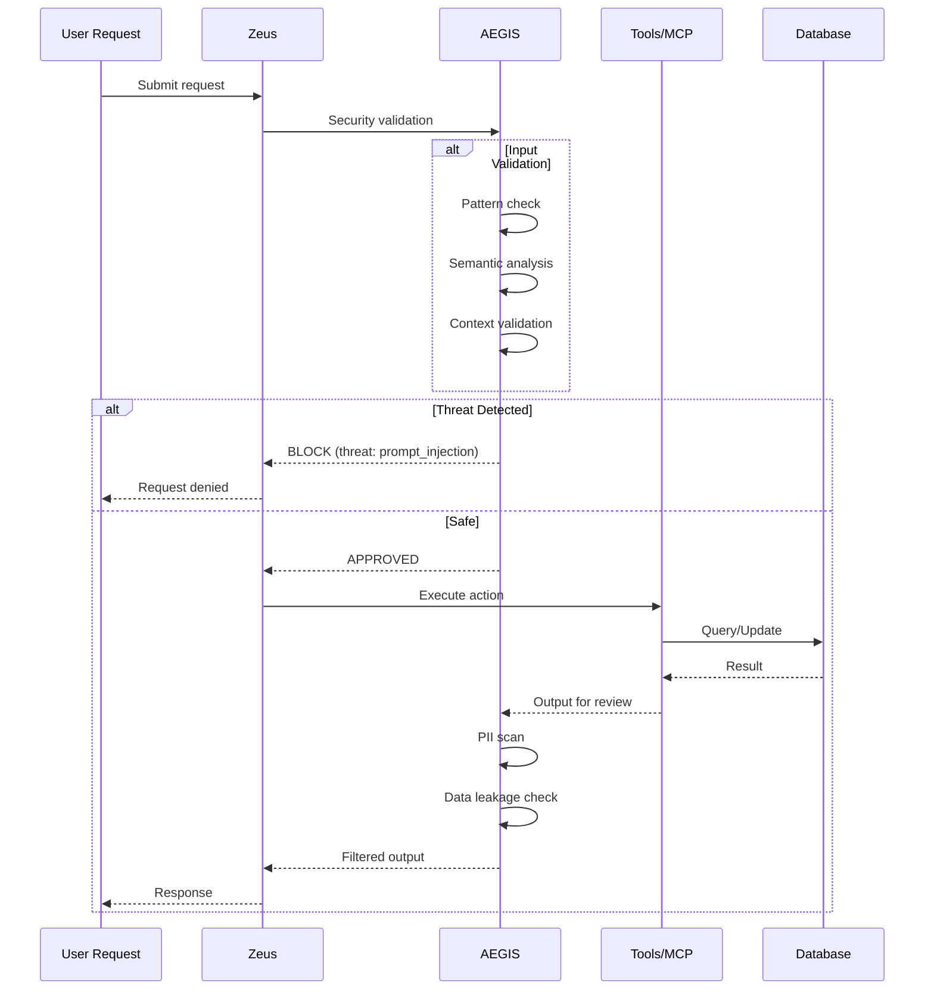

# Security Framework

KOSMOS V2.0 implements defense-in-depth with 6 security layers and comprehensive threat modeling.

## 6-Layer Defense Architecture

```mermaid
graph TB
    subgraph L1["Layer 1: Edge Protection"]
        WAF["Cloudflare WAF"]
        DDoS["DDoS Protection"]
        Bot["Bot Detection"]
        RL1["Rate Limiting"]
    end

    subgraph L2["Layer 2: API Gateway"]
        Kong["Kong/APISIX"]
        JWT["JWT Validation"]
        RV["Request Validation"]
        Quota["Quota Enforcement"]
    end

    subgraph L3["Layer 3: Identity & Access"]
        Zitadel["Zitadel OIDC"]
        MFA["MFA"]
        RBAC["RBAC"]
        Session["Session Mgmt"]
    end

    subgraph L4["Layer 4: AI Security"]
        PA["Prompt Armor"]
        Guard["Guardrails"]
        Filter["Output Filtering"]
        PII["PII Detection"]
    end

    subgraph L5["Layer 5: Runtime Security"]
        Falco["Falco"]
        Kyverno["Kyverno Policies"]
        NetPol["Network Policies"]
        PSS["Pod Security"]
    end

    subgraph L6["Layer 6: Data Protection"]
        TLS["TLS 1.3"]
        Secrets["Infisical Secrets"]
        FLE["Field Encryption"]
    end

    L1 --> L2
    L2 --> L3
    L3 --> L4
    L4 --> L5
    L5 --> L6

    style L1 fill:#ef4444
    style L2 fill:#f97316
    style L3 fill:#eab308
    style L4 fill:#22c55e
    style L5 fill:#3b82f6
    style L6 fill:#8b5cf6
```



### Layer Details

| Layer | Components | Threats Blocked |
|-------|------------|-----------------|
| **Edge** | Cloudflare WAF, DDoS, Bot Detection | Network attacks, bots, DDoS |
| **Gateway** | Kong, JWT, Request Validation | Unauthorized access, malformed requests |
| **Identity** | Zitadel, MFA, RBAC | Identity theft, privilege escalation |
| **AI Security** | Prompt Armor, Guardrails, PII | Prompt injection, data leakage |
| **Runtime** | Falco, Kyverno, Network Policies | Container escapes, lateral movement |
| **Data** | TLS 1.3, Encryption, Secrets | Data theft, credential exposure |

## STRIDE Threat Model

### Spoofing

| ID | Threat | Target | Risk | Mitigation |
|----|--------|--------|------|------------|
| S-001 | Session Hijacking | User sessions | High | Short-lived JWTs, refresh token rotation |
| S-002 | API Key Theft | Service accounts | High | Key rotation, scoping, monitoring |
| S-003 | Credential Stuffing | User accounts | Medium | MFA, rate limiting, breach detection |

### Tampering

| ID | Threat | Target | Risk | Mitigation |
|----|--------|--------|------|------------|
| T-001 | Prompt Injection | LLM inputs | Critical | Input validation, guardrails, Prompt Armor |
| T-002 | Data Modification | Database records | High | Audit logging, integrity checks |
| T-003 | Model Poisoning | Training data | High | Data validation, provenance tracking |

### Repudiation

| ID | Threat | Target | Risk | Mitigation |
|----|--------|--------|------|------------|
| R-001 | Action Denial | User actions | Medium | Comprehensive audit logging |
| R-002 | Log Tampering | Audit logs | High | Immutable logging, log signing |

### Information Disclosure

| ID | Threat | Target | Risk | Mitigation |
|----|--------|--------|------|------------|
| I-001 | Conversation Leakage | User data | Critical | Encryption, access controls |
| I-002 | System Prompt Extraction | AI prompts | High | Prompt protection, guardrails |
| I-003 | API Key Exposure | Credentials | Critical | Secret management, scanning |

### Denial of Service

| ID | Threat | Target | Risk | Mitigation |
|----|--------|--------|------|------------|
| D-001 | Network DDoS | API endpoints | High | CDN, rate limiting, WAF |
| D-002 | Resource Exhaustion | LLM calls | High | Quotas, circuit breakers |
| D-003 | Agent Loops | Orchestrator | Medium | Loop detection, timeouts |

### Elevation of Privilege

| ID | Threat | Target | Risk | Mitigation |
|----|--------|--------|------|------------|
| E-001 | Role Escalation | User permissions | High | RBAC, privilege auditing |
| E-002 | Agent Privilege Abuse | Agent actions | High | Least privilege, sandboxing |
| E-003 | Container Escape | Infrastructure | High | Security contexts, Pod security |

## AEGIS Security Flow



## AI-Specific Security

### Prompt Armor

```python
class PromptArmorGuard:
    """AI security layer for prompt injection detection."""

    async def validate_input(self, user_input: str, context: dict) -> ValidationResult:
        results = await asyncio.gather(
            self._pattern_check(user_input),    # Known injection patterns
            self._semantic_check(user_input),   # ML-based detection
            self._context_check(user_input, context)  # Context validation
        )

        return ValidationResult(
            is_safe=all(r.is_safe for r in results),
            threats=self._aggregate_threats(results),
            confidence=min(r.confidence for r in results)
        )

    async def filter_output(self, model_output: str, request_context: dict) -> str:
        output = await self._redact_pii(model_output)
        output = await self._check_data_leakage(output, request_context)
        output = await self._validate_content(output)
        return output
```

### Guardrails

- Input validation before LLM calls
- Output filtering for sensitive data
- PII detection and redaction
- Toxicity filtering
- Hallucination detection

## Secrets Management

Using Infisical for centralized secrets:

```python
class SecretsManager:
    async def get_secret(self, key: str, environment: str = "production") -> str:
        secret = await self.client.get_secret(
            secret_name=key,
            environment=environment,
            path="/kosmos"
        )
        return secret.secret_value

    async def rotate_secret(self, key: str, generator: Callable[[], str]) -> None:
        new_value = generator()
        await self.client.update_secret(secret_name=key, secret_value=new_value)
        await self._notify_rotation(key)
```

## Compliance

### Implemented Standards

| Standard | Status | Features |
|----------|--------|----------|
| **GDPR** | Compliant | Data subject rights, consent, amnesia protocol |
| **CCPA** | Compliant | Do not sell, data deletion, disclosure |
| **UAE PDPL** | Compliant | Local residency, consent, cross-border |
| **NIST AI RMF** | Implemented | AI risk management |
| **NIST CSF** | Implemented | Cybersecurity framework |

### In Progress

| Standard | Target |
|----------|--------|
| ISO 27001 | Certification in progress |
| ISO 42001 | Gap analysis complete |
| SOC 2 Type II | Audit scheduled |
| Saudi PDPL | Q2 2026 |

## Audit Logging

Immutable audit trail for all actions:

```sql
CREATE TABLE audit.events (
    id UUID PRIMARY KEY,
    event_type VARCHAR(100) NOT NULL,
    actor_type VARCHAR(20) NOT NULL,  -- 'user', 'agent', 'system'
    actor_id VARCHAR(100) NOT NULL,
    resource_type VARCHAR(100),
    resource_id VARCHAR(100),
    action VARCHAR(50) NOT NULL,
    details JSONB DEFAULT '{}',
    ip_address INET,
    created_at TIMESTAMPTZ DEFAULT NOW()
);

-- Prevent modifications
CREATE TRIGGER prevent_audit_modification
    BEFORE UPDATE OR DELETE ON audit.events
    FOR EACH ROW EXECUTE FUNCTION audit.prevent_modification();
```
