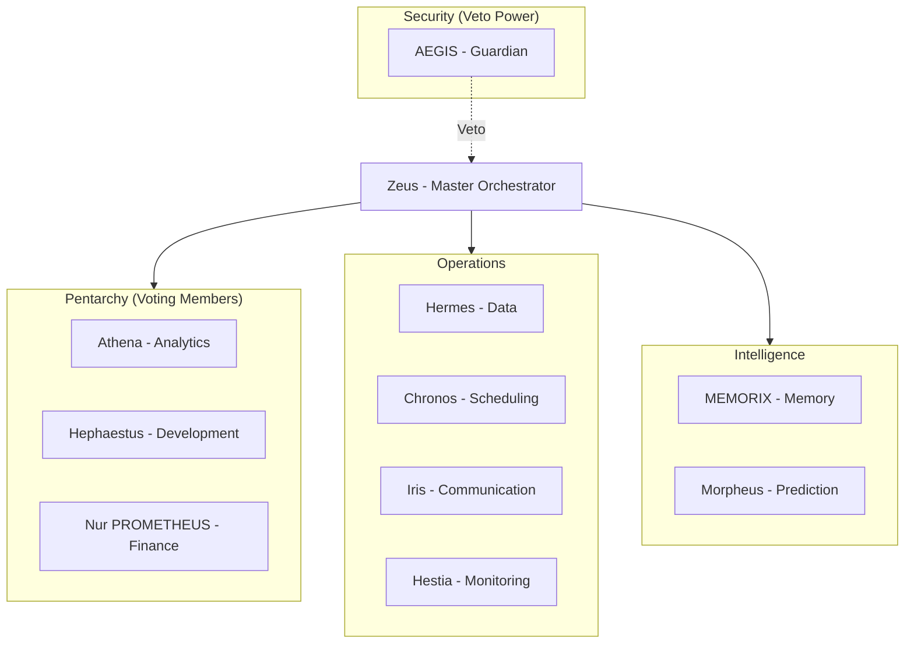

# KOSMOS V2.0 Agents

KOSMOS is powered by **11 specialized AI agents**, each with distinct capabilities and responsibilities.

## Agent Hierarchy

## The 11 Agents

| Agent | Domain | Key Capabilities | Pentarchy |
|-------|--------|------------------|-----------|
| **Zeus** | Orchestration | Request routing, workflow coordination | No (Orchestrator) |
| **Hermes** | Data | ETL, data transformation, delivery | No |
| **AEGIS** | Security | Auth, authorization, security veto | No (Veto Power) |
| **Athena** | Analytics | Insights, RAG, knowledge base | **Yes** |
| **Chronos** | Scheduling | Calendar, reminders, time management | No |
| **Hephaestus** | Development | Code generation, DevOps, CI/CD | **Yes** |
| **Nur PROMETHEUS** | Finance | Budgeting, cost estimation, financial ops | **Yes** |
| **Iris** | Communication | Notifications, messaging, alerts | No |
| **MEMORIX** | Memory | Context management, knowledge graphs | No |
| **Hestia** | Operations | Monitoring, health checks, metrics | No |
| **Morpheus** | Prediction | Forecasting, ML inference, trends | No |

## Pentarchy Governance

For decisions involving costs between $50-$100, three agents vote:
- **Athena** - Evaluates analytical impact
- **Hephaestus** - Evaluates technical feasibility
- **Nur PROMETHEUS** - Evaluates financial implications

Majority (2/3) required for approval. AEGIS can veto any decision.

## Agent Documentation

:::info Auto-Generated
Agent documentation in this section is **automatically generated** from Python docstrings and code annotations. Updates sync on every commit.
:::

Browse individual agent documentation:
- [Zeus](./zeus) - Master Orchestrator
- [Hermes](./hermes) - Data Agent
- [AEGIS](./aegis) - Security Guardian
- [Athena](./athena) - Analytics Agent
- [Chronos](./chronos) - Scheduling Agent
- [Hephaestus](./hephaestus) - Development Agent
- [Nur PROMETHEUS](./nur_prometheus) - Finance Agent
- [Iris](./iris) - Communication Agent
- [MEMORIX](./memorix) - Memory Agent
- [Hestia](./hestia) - Operations Agent
- [Morpheus](./morpheus) - Prediction Agent
