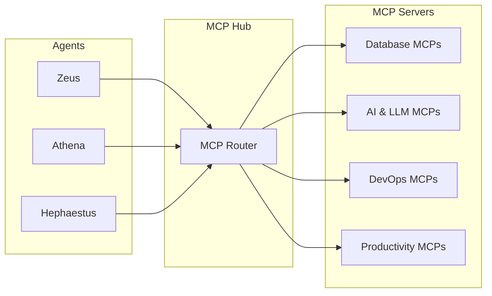

# MCP Servers Overview

KOSMOS integrates **88 MCP servers** across **9 domains** to provide comprehensive tool access for AI agents.

## Statistics

| Metric | Count |
|--------|-------|
| Total MCP Servers | 88 |
| Implemented | 2 |
| Total Tools | 16 |
| Domains | 9 |

## Domain Summary

| Domain | Servers | Implemented | Status |
|--------|---------|-------------|--------|
| [Database & Storage](./database) | 12 | 0 | Planned |
| [AI & Reasoning](./ai-llm) | 15 | 1 | Active |
| [Productivity & Communication](./productivity) | 15 | 0 | Planned |
| [DevOps & Infrastructure](./development) | 13 | 0 | Planned |
| [Security](./security) | 10 | 0 | Planned |
| [Finance & Analytics](./finance) | 6 | 0 | Planned |
| [Cloud Providers](./cloud) | 6 | 0 | Planned |
| [Data & ETL](./data) | 6 | 0 | Planned |
| [KOSMOS Native](./kosmos) | 5 | 1 | Active |


## Architecture



## Tool Calling

Agents call MCP tools through a unified interface:

```python
class BaseAgent:
    async def call_mcp(
        self,
        server: str,
        tool: str,
        params: Dict[str, Any]
    ) -> Any:
        '''Call an MCP server tool.'''
        return await self.mcp_clients[server].call_tool(tool, params)
```

See individual domain pages for specific tool documentation.
