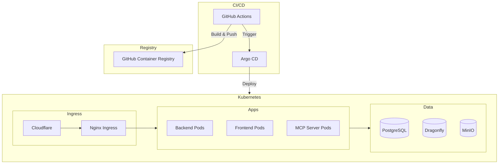

# Deployment Overview

KOSMOS V2.0 is designed for cloud-native deployment using Kubernetes and GitOps.

## Deployment Architecture

## Deployment Options

| Environment | Method | Recommended For |
|-------------|--------|-----------------|
| **Development** | Docker Compose | Local development |
| **Staging** | K3s + Argo CD | Testing, demos |
| **Production** | Kubernetes + Argo CD | Live deployment |

## Quick Links

- **[Kubernetes Deployment](./kubernetes)** - Full K8s deployment guide

## Infrastructure Requirements

### Minimum (Staging)

| Resource | Specification |
|----------|---------------|
| Nodes | 3 nodes (2 vCPU, 4GB each) |
| Storage | 100GB SSD |
| Network | 100 Mbps |

### Recommended (Production)

| Resource | Specification |
|----------|---------------|
| Nodes | 5+ nodes (4 vCPU, 16GB each) |
| Storage | 500GB+ NVMe SSD |
| Network | 1 Gbps |
| HA | Multi-zone deployment |
