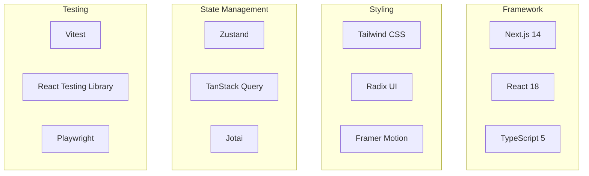

# Frontend Components

KOSMOS V2.0 frontend built with **Next.js 14**, **React**, and **TypeScript**.

## Tech Stack



## Component Categories

| Category | Components | Description |
|----------|------------|-------------|
| **Layout** | 8 | Shell, sidebar, navigation |
| **Agent UI** | 15 | Agent cards, chat, status |
| **Forms** | 12 | Inputs, selects, validation |
| **Data Display** | 10 | Tables, charts, cards |
| **Feedback** | 6 | Toasts, modals, alerts |
| **Utilities** | 5 | Loading, error boundaries |

## Design System

### Colors
Primary palette based on Indigo:
- Primary: `#4f46e5`
- Secondary: `#6366f1`
- Accent: `#818cf8`

### Typography
- Headings: Inter (700)
- Body: Inter (400)
- Code: JetBrains Mono

### Spacing
8px grid system with consistent spacing tokens.

## Key Components

### AgentChat
Real-time chat interface for agent interactions.

```tsx
<AgentChat
  agent="zeus"
  onMessage={(msg) => console.log(msg)}
  streaming={true}
/>
```

### TaskCard
Display task status and progress.

```tsx
<TaskCard
  task={task}
  showProgress={true}
  onCancel={() => cancelTask(task.id)}
/>
```

### GovernanceVote
Pentarchy voting interface.

```tsx
<GovernanceVote
  decision={decision}
  voters={['athena', 'hephaestus', 'prometheus']}
  onVote={(vote) => submitVote(vote)}
/>
```

## Project Structure

```
frontend/
├── src/
│   ├── app/           # Next.js App Router
│   ├── components/    # React components
│   │   ├── ui/        # Base UI components
│   │   ├── agents/    # Agent-specific components
│   │   └── layout/    # Layout components
│   ├── hooks/         # Custom React hooks
│   ├── lib/           # Utilities and helpers
│   ├── stores/        # Zustand stores
│   └── types/         # TypeScript types
├── public/            # Static assets
└── tests/             # Test files
```

:::info Auto-Generated
Component documentation is **automatically generated** from TypeScript types, JSDoc comments, and Storybook stories. Updates sync on every commit.
:::

## Browse Components

- [Components](./components)
- [Hooks](./hooks)
- [State Management](./state-management)
