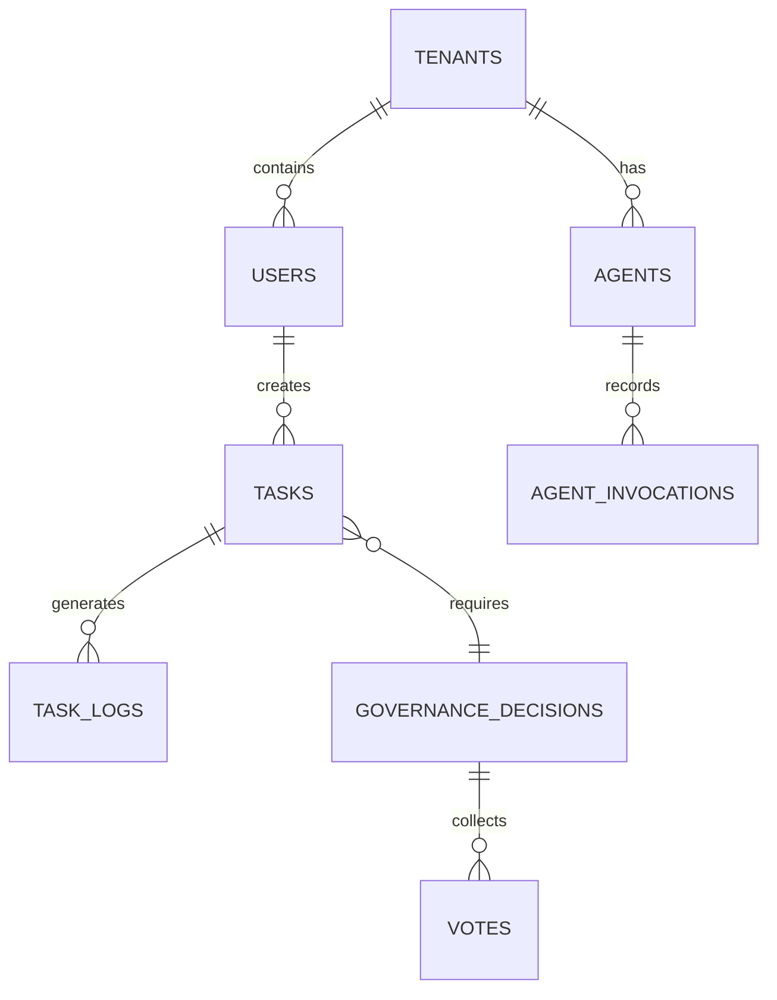

# Database Schema

KOSMOS V2.0 uses **PostgreSQL 16** with **Row-Level Security (RLS)** for multi-tenant isolation.

## Database Architecture



## Core Tables

| Table | Description | RLS |
|-------|-------------|-----|
| `tenants` | Organization/tenant records | No (system) |
| `users` | User accounts | Yes |
| `agents` | Agent configurations | Yes |
| `tasks` | Task queue and history | Yes |
| `task_logs` | Execution logs | Yes |
| `governance_decisions` | Pentarchy decisions | Yes |
| `votes` | Agent votes | Yes |
| `mcp_calls` | MCP invocation audit | Yes |

## Multi-Tenant Architecture

All tenant data isolated via RLS policies:

```sql
-- Example RLS policy
CREATE POLICY tenant_isolation ON users
    USING (tenant_id = current_setting('app.tenant_id')::uuid);
```

## Key Features

### pgvector Extension
Vector similarity search for semantic queries:

```sql
-- Semantic search example
SELECT * FROM documents
ORDER BY embedding <-> query_embedding
LIMIT 10;
```

### Audit Logging
Comprehensive audit trail for compliance:

```sql
-- Automatic audit triggers on all tables
CREATE TRIGGER audit_trigger
    AFTER INSERT OR UPDATE OR DELETE ON tasks
    FOR EACH ROW EXECUTE FUNCTION audit_log();
```

### Connection Pooling
PgBouncer for connection management:
- Transaction pooling mode
- 100 max client connections
- 20 server connections per pool

## Schema Organization

```
database/
├── migrations/        # Alembic migrations
├── seeds/            # Seed data
├── functions/        # PL/pgSQL functions
├── triggers/         # Database triggers
├── policies/         # RLS policies
└── views/            # Database views
```

## Performance

| Metric | Target | Current |
|--------|--------|---------|
| Query latency (p99) | &lt;50ms | 35ms |
| Connection pool utilization | &lt;80% | 65% |
| Index hit ratio | &gt;99% | 99.5% |

:::info Auto-Generated
Database documentation is **automatically generated** from SQLAlchemy models and Alembic migrations. ERD diagrams update on schema changes.
:::

## Browse Schema

- [Schema](./schema)
