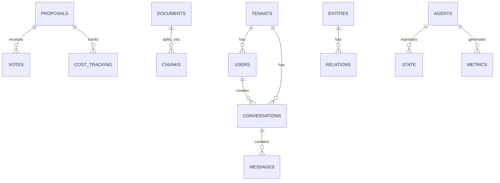

# Database Schema

Complete reference for the KOSMOS PostgreSQL database schema.

:::info Auto-Generated
This documentation is automatically extracted from SQL migration files.
:::

## Entity Relationship Diagram



## Database Schemas

KOSMOS uses a multi-schema PostgreSQL design for logical separation:

| Schema | Purpose |
|--------|--------|
| `agents` | Agent registry, state, and metrics |
| `audit` | Immutable audit logging |
| `core` | Users, tenants, conversations, messages |
| `governance` | Pentarchy voting, proposals, cost tracking |
| `knowledge` | RAG documents, embeddings, knowledge graph |
| `metrics` | Performance and operational metrics |

## `agents` Schema

### registry

AGENTS SCHEMA - Agent State and Configuration

| Column | Type | Nullable | Default | References |
|--------|------|----------|---------|------------|
| `id` **PK** | `VARCHAR(50)` | YES | - | - |
| `name` | `VARCHAR(100)` | NO | - | - |
| `domain` | `VARCHAR(100)` | NO | - | - |
| `description` | `TEXT` | YES | - | - |
| `tools` | `JSONB` | YES | `'[]'` | - |
| `mcp_servers` | `JSONB` | YES | `'[]'` | - |
| `config` | `JSONB` | YES | `'{}'` | - |
| `status` | `VARCHAR(20)` | YES | `'active'` | - |
| `created_at` | `TIMESTAMPTZ` | YES | `NOW()` | - |
| `updated_at` | `TIMESTAMPTZ` | YES | `NOW()` | - |

### state

Agent state (for persistence)

| Column | Type | Nullable | Default | References |
|--------|------|----------|---------|------------|
| `id` **PK** | `UUID` | YES | `uuid_generate_v4()` | - |
| `agent_id` | `VARCHAR(50)` | NO | - | `agents.registry.id` |
| `conversation_id` | `UUID` | YES | - | `core.conversations.id` |
| `state` | `JSONB` | NO | - | - |
| `version` | `INTEGER` | NO | `1` | - |
| `created_at` | `TIMESTAMPTZ` | YES | `NOW()` | - |
| `updated_at` | `TIMESTAMPTZ` | YES | `NOW()` | - |

### metrics

Agent metrics

| Column | Type | Nullable | Default | References |
|--------|------|----------|---------|------------|
| `id` **PK** | `UUID` | YES | `uuid_generate_v4()` | - |
| `agent_id` | `VARCHAR(50)` | NO | - | `agents.registry.id` |
| `metric_name` | `VARCHAR(100)` | NO | - | - |
| `metric_value` | `DOUBLE PRECISION` | NO | - | - |
| `labels` | `JSONB` | YES | `'{}'` | - |
| `recorded_at` | `TIMESTAMPTZ` | YES | `NOW()` | - |

## `audit` Schema

### events

AUDIT SCHEMA - Immutable Audit Log

| Column | Type | Nullable | Default | References |
|--------|------|----------|---------|------------|
| `id` **PK** | `UUID` | YES | `uuid_generate_v4()` | - |
| `tenant_id` | `UUID` | NO | - | - |
| `event_type` | `VARCHAR(100)` | NO | - | - |
| `actor_id` | `VARCHAR(100)` | NO | - | - |
| `resource_type` | `VARCHAR(100)` | YES | - | - |
| `resource_id` | `VARCHAR(100)` | YES | - | - |
| `action` | `VARCHAR(50)` | NO | - | - |
| `details` | `JSONB` | YES | `'{}'` | - |
| `ip_address` | `INET` | YES | - | - |
| `user_agent` | `TEXT` | YES | - | - |
| `created_at` | `TIMESTAMPTZ` | YES | `NOW()` | - |

## `core` Schema

### tenants

CORE SCHEMA - Tenants, Users, Conversations

| Column | Type | Nullable | Default | References |
|--------|------|----------|---------|------------|
| `id` **PK** | `UUID` | YES | `uuid_generate_v4()` | - |
| `name` | `VARCHAR(255)` | NO | - | - |
| `slug` | `VARCHAR(100)` | NO | - | - |
| `settings` | `JSONB` | YES | `'{}'` | - |
| `created_at` | `TIMESTAMPTZ` | YES | `NOW()` | - |
| `updated_at` | `TIMESTAMPTZ` | YES | `NOW()` | - |

### users

Users table

| Column | Type | Nullable | Default | References |
|--------|------|----------|---------|------------|
| `id` **PK** | `UUID` | YES | `uuid_generate_v4()` | - |
| `tenant_id` | `UUID` | NO | - | `core.tenants.id` |
| `external_id` | `VARCHAR(255),` | YES | - | - |
| `email` | `VARCHAR(255)` | NO | - | - |
| `name` | `VARCHAR(255)` | YES | - | - |
| `role` | `VARCHAR(50)` | YES | `'user'` | - |
| `preferences` | `JSONB` | YES | `'{}'` | - |
| `created_at` | `TIMESTAMPTZ` | YES | `NOW()` | - |
| `updated_at` | `TIMESTAMPTZ` | YES | `NOW()` | - |

### conversations

Conversations table

| Column | Type | Nullable | Default | References |
|--------|------|----------|---------|------------|
| `id` **PK** | `UUID` | YES | `uuid_generate_v4()` | - |
| `tenant_id` | `UUID` | NO | - | `core.tenants.id` |
| `user_id` | `UUID` | NO | - | `core.users.id` |
| `title` | `VARCHAR(500)` | YES | - | - |
| `metadata` | `JSONB` | YES | `'{}'` | - |
| `started_at` | `TIMESTAMPTZ` | YES | `NOW()` | - |
| `ended_at` | `TIMESTAMPTZ` | YES | - | - |
| `created_at` | `TIMESTAMPTZ` | YES | `NOW()` | - |
| `updated_at` | `TIMESTAMPTZ` | YES | `NOW()` | - |

### messages

Messages table

| Column | Type | Nullable | Default | References |
|--------|------|----------|---------|------------|
| `id` **PK** | `UUID` | YES | `uuid_generate_v4()` | - |
| `conversation_id` | `UUID` | NO | - | `core.conversations.id` |
| `tenant_id` | `UUID` | NO | - | `core.tenants.id` |
| `content` | `TEXT` | NO | - | - |
| `agent_id` | `VARCHAR(50)` | YES | - | - |
| `tool_calls` | `JSONB` | YES | - | - |
| `tokens_input` | `INTEGER` | YES | - | - |
| `tokens_output` | `INTEGER` | YES | - | - |
| `cost_usd` | `DECIMAL(10, 6)` | YES | - | - |
| `latency_ms` | `INTEGER` | YES | - | - |
| `created_at` | `TIMESTAMPTZ` | YES | `NOW()` | - |

## `governance` Schema

### proposals

GOVERNANCE SCHEMA - Pentarchy Voting and Approvals

| Column | Type | Nullable | Default | References |
|--------|------|----------|---------|------------|
| `id` **PK** | `UUID` | YES | `uuid_generate_v4()` | - |
| `tenant_id` | `UUID` | NO | - | `core.tenants.id` |
| `conversation_id` | `UUID` | YES | - | `core.conversations.id` |
| `action` | `VARCHAR(200)` | NO | - | - |
| `description` | `TEXT` | YES | - | - |
| `estimated_cost` | `DECIMAL(10, 2)` | YES | - | - |
| `context` | `JSONB` | YES | `'{}'` | - |
| `outcome` | `VARCHAR(20)` | YES | - | - |
| `decided_by` | `VARCHAR(50)` | YES | - | - |
| `created_at` | `TIMESTAMPTZ` | YES | `NOW()` | - |
| `resolved_at` | `TIMESTAMPTZ` | YES | - | - |

### votes

Votes

| Column | Type | Nullable | Default | References |
|--------|------|----------|---------|------------|
| `id` **PK** | `UUID` | YES | `uuid_generate_v4()` | - |
| `proposal_id` | `UUID` | NO | - | `governance.proposals.id` |
| `voter_agent` | `VARCHAR(50)` | NO | - | - |
| `reasoning` | `TEXT` | YES | - | - |
| `created_at` | `TIMESTAMPTZ` | YES | `NOW()` | - |

### cost_tracking

Cost tracking

| Column | Type | Nullable | Default | References |
|--------|------|----------|---------|------------|
| `id` **PK** | `UUID` | YES | `uuid_generate_v4()` | - |
| `tenant_id` | `UUID` | NO | - | `core.tenants.id` |
| `proposal_id` | `UUID` | YES | - | `governance.proposals.id` |
| `tool_name` | `VARCHAR(100)` | NO | - | - |
| `agent_id` | `VARCHAR(50)` | YES | - | - |
| `estimated_cost` | `DECIMAL(12, 4)` | NO | - | - |
| `actual_cost` | `DECIMAL(12, 4)` | YES | - | - |
| `variance_pct` | `DECIMAL(5, 2)` | YES | - | - |
| `governance_decision` | `VARCHAR(20)` | YES | - | - |
| `approved_by` | `VARCHAR(50)` | YES | - | - |
| `created_at` | `TIMESTAMPTZ` | YES | `NOW()` | - |
| `completed_at` | `TIMESTAMPTZ` | YES | - | - |

## `knowledge` Schema

### documents

KNOWLEDGE SCHEMA - RAG and Documents

| Column | Type | Nullable | Default | References |
|--------|------|----------|---------|------------|
| `id` **PK** | `UUID` | YES | `uuid_generate_v4()` | - |
| `tenant_id` | `UUID` | NO | - | `core.tenants.id` |
| `source_url` | `TEXT` | YES | - | - |
| `title` | `VARCHAR(500)` | YES | - | - |
| `content` | `TEXT` | NO | - | - |
| `content_type` | `VARCHAR(50)` | YES | `'text/plain'` | - |
| `metadata` | `JSONB` | YES | `'{}'` | - |
| `status` | `VARCHAR(20)` | YES | `'active'` | - |
| `created_at` | `TIMESTAMPTZ` | YES | `NOW()` | - |
| `updated_at` | `TIMESTAMPTZ` | YES | `NOW()` | - |

### chunks

Document chunks with embeddings

| Column | Type | Nullable | Default | References |
|--------|------|----------|---------|------------|
| `id` **PK** | `UUID` | YES | `uuid_generate_v4()` | - |
| `document_id` | `UUID` | NO | - | `knowledge.documents.id` |
| `tenant_id` | `UUID` | NO | - | `core.tenants.id` |
| `content` | `TEXT` | NO | - | - |
| `embedding` | `vector(768),` | YES | - | - |
| `chunk_index` | `INTEGER` | NO | - | - |
| `token_count` | `INTEGER` | YES | - | - |
| `metadata` | `JSONB` | YES | `'{}'` | - |
| `created_at` | `TIMESTAMPTZ` | YES | `NOW()` | - |

### entities

Full-text search column

| Column | Type | Nullable | Default | References |
|--------|------|----------|---------|------------|
| `id` **PK** | `UUID` | YES | `uuid_generate_v4()` | - |
| `tenant_id` | `UUID` | NO | - | `core.tenants.id` |
| `user_id` | `UUID` | YES | - | `core.users.id` |
| `name` | `VARCHAR(255)` | NO | - | - |
| `entity_type` | `VARCHAR(100)` | NO | - | - |
| `observations` | `JSONB` | YES | `'[]'` | - |
| `embedding` | `vector(1536),` | YES | - | - |
| `importance_score` | `FLOAT` | YES | `0.5` | - |
| `decay_rate` | `FLOAT` | YES | `0.01` | - |
| `created_at` | `TIMESTAMPTZ` | YES | `NOW()` | - |
| `accessed_at` | `TIMESTAMPTZ` | YES | `NOW()` | - |

### relations

Memory relations

| Column | Type | Nullable | Default | References |
|--------|------|----------|---------|------------|
| `id` **PK** | `UUID` | YES | `uuid_generate_v4()` | - |
| `tenant_id` | `UUID` | NO | - | `core.tenants.id` |
| `from_entity_id` | `UUID` | NO | - | `knowledge.entities.id` |
| `to_entity_id` | `UUID` | NO | - | `knowledge.entities.id` |
| `relation_type` | `VARCHAR(100)` | NO | - | - |
| `properties` | `JSONB` | YES | `'{}'` | - |
| `created_at` | `TIMESTAMPTZ` | YES | `NOW()` | - |

## Indexes

Performance-optimized indexes:

| Index | Table | Columns |
|-------|-------|--------|
| `idx_users_tenant` | `core.users` | `tenant_id` |
| `idx_users_email` | `core.users` | `email` |
| `idx_conversations_tenant` | `core.conversations` | `tenant_id` |
| `idx_conversations_user` | `core.conversations` | `user_id` |
| `idx_messages_conversation` | `core.messages` | `conversation_id` |
| `idx_messages_created` | `core.messages` | `created_at` |
| `idx_agent_state_agent` | `agents.state` | `agent_id` |
| `idx_agent_state_conversation` | `agents.state` | `conversation_id` |
| `idx_agent_metrics_agent` | `agents.metrics` | `agent_id` |
| `idx_agent_metrics_recorded` | `agents.metrics` | `recorded_at` |
| `idx_proposals_tenant` | `governance.proposals` | `tenant_id` |
| `idx_proposals_status` | `governance.proposals` | `status` |
| `idx_votes_proposal` | `governance.votes` | `proposal_id` |
| `idx_cost_tracking_tenant` | `governance.cost_tracking` | `tenant_id` |
| `idx_documents_tenant` | `knowledge.documents` | `tenant_id` |
| `idx_chunks_document` | `knowledge.chunks` | `document_id` |
| `idx_chunks_tenant` | `knowledge.chunks` | `tenant_id` |
| `idx_entities_tenant` | `knowledge.entities` | `tenant_id` |
| `idx_entities_user` | `knowledge.entities` | `user_id` |
| `idx_entities_type` | `knowledge.entities` | `entity_type` |
| `idx_relations_from` | `knowledge.relations` | `from_entity_id` |
| `idx_relations_to` | `knowledge.relations` | `to_entity_id` |
| `idx_audit_tenant` | `audit.events` | `tenant_id` |
| `idx_audit_created` | `audit.events` | `created_at` |
| `idx_audit_actor` | `audit.events` | `actor_type`, `actor_id` |
| `idx_audit_resource` | `audit.events` | `resource_type`, `resource_id` |

## Row Level Security

KOSMOS implements multi-tenancy using PostgreSQL Row Level Security (RLS):

```sql
-- Example: Tenant isolation policy
CREATE POLICY tenant_isolation_users ON core.users
    USING (tenant_id = current_setting('app.current_tenant', true)::uuid);
```

All tenant-scoped tables have RLS enabled to ensure data isolation.

## Extensions

Required PostgreSQL extensions:

| Extension | Purpose |
|-----------|---------|
| `uuid-ossp` | UUID generation |
| `pgvector` | Vector embeddings for RAG |
| `pg_trgm` | Fuzzy text search |

