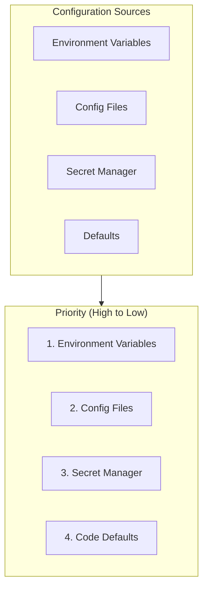

# Configuration Reference

Complete environment variables and configuration options for KOSMOS V2.0.

## Configuration Hierarchy



## Environment Categories

| Category | Prefix | Description |
|----------|--------|-------------|
| **Database** | `DB_*` | PostgreSQL connection |
| **Redis** | `REDIS_*` | Cache configuration |
| **Auth** | `AUTH_*` | Authentication settings |
| **Agents** | `AGENT_*` | Agent configurations |
| **MCP** | `MCP_*` | MCP server settings |
| **Observability** | `LOG_*`, `OTEL_*` | Logging and tracing |

## Essential Variables

### Database

```bash
# PostgreSQL connection
DB_HOST=localhost
DB_PORT=5432
DB_NAME=kosmos
DB_USER=kosmos
DB_PASSWORD=<secret>
DB_POOL_SIZE=20
DB_MAX_OVERFLOW=10
```

### Redis

```bash
# Redis/DragonflyDB
REDIS_URL=redis://localhost:6379/0
REDIS_PASSWORD=<secret>
REDIS_MAX_CONNECTIONS=100
```

### Authentication

```bash
# JWT Configuration
AUTH_SECRET_KEY=<secret>
AUTH_ALGORITHM=HS256
AUTH_ACCESS_TOKEN_EXPIRE=3600
AUTH_REFRESH_TOKEN_EXPIRE=604800
```

### Agents

```bash
# Agent settings
AGENT_DEFAULT_TIMEOUT=30000
AGENT_MAX_RETRIES=3
AGENT_PENTARCHY_THRESHOLD=50
AGENT_VETO_ENABLED=true
```

### MCP Servers

```bash
# MCP Hub
MCP_HUB_URL=http://localhost:8001
MCP_TIMEOUT=10000
MCP_MAX_CONCURRENT=50
```

### Observability

```bash
# Logging
LOG_LEVEL=INFO
LOG_FORMAT=json
LOG_OUTPUT=stdout

# OpenTelemetry
OTEL_ENABLED=true
OTEL_ENDPOINT=http://localhost:4317
OTEL_SERVICE_NAME=kosmos-api
```

## Configuration Files

### `config/default.yaml`
Default settings for all environments.

### `config/production.yaml`
Production-specific overrides.

### `config/development.yaml`
Development environment settings.

## Secrets Management

Sensitive values should use secret managers:

```bash
# Supported backends
SECRETS_BACKEND=aws_secrets_manager  # or: vault, gcp_secrets
SECRETS_PREFIX=kosmos/prod/
```

## Validation

Configuration validated at startup using Pydantic:

```python
class Settings(BaseSettings):
    db_host: str
    db_port: int = 5432
    db_password: SecretStr

    class Config:
        env_prefix = "DB_"
```

:::info Auto-Generated
Configuration documentation is **automatically generated** from Pydantic Settings classes. Environment variables and defaults extracted from code.
:::

## Browse Configuration

- [Environment Variables](./environment-variables)
