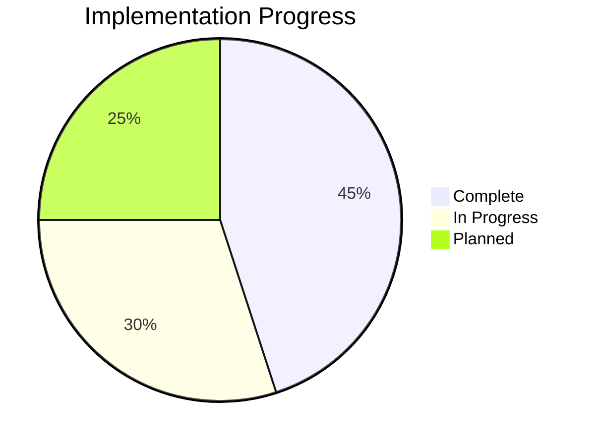

# Governance & Project Meta

Project governance, gap analysis, roadmap, and contribution guidelines for KOSMOS V2.0.

## Project Status

## Documentation Sections

### Gap Analysis
Current implementation gaps and technical debt tracking.

| Area | Status | Priority |
|------|--------|----------|
| Core Agents | 70% complete | High |
| MCP Integration | 60% complete | High |
| Frontend | 50% complete | Medium |
| Testing | 40% complete | High |
| Documentation | 80% complete | Medium |

### Roadmap

#### Q1 2026
- [ ] Complete all 11 agent implementations
- [ ] Production-ready MCP hub
- [ ] Comprehensive test coverage (>80%)

#### Q2 2026
- [ ] Multi-tenant production deployment
- [ ] Advanced Pentarchy governance
- [ ] AI search integration

#### Q3 2026
- [ ] Mobile application (React Native)
- [ ] Desktop application (Tauri)
- [ ] Enterprise features

### Contributing

We welcome contributions! Please read our guidelines:

1. **Code of Conduct** - Be respectful and inclusive
2. **Development Setup** - See Getting Started guide
3. **Pull Requests** - Follow PR template
4. **Code Style** - ESLint + Prettier for TypeScript, Black + isort for Python

### Architecture Decision Records (ADRs)

Key architectural decisions documented:

| ADR | Title | Status |
|-----|-------|--------|
| ADR-001 | Multi-agent architecture | Accepted |
| ADR-002 | Pentarchy governance model | Accepted |
| ADR-003 | MCP integration pattern | Accepted |
| ADR-004 | Multi-tenant RLS | Accepted |
| ADR-005 | Event sourcing for audit | Proposed |

## Versioning

KOSMOS follows [Semantic Versioning](https://semver.org/):

- **Major**: Breaking API changes
- **Minor**: New features, backward compatible
- **Patch**: Bug fixes

Current: `2.0.0-alpha`

## License

KOSMOS V2.0 is proprietary software owned by Nuvanta Holding.

## Contact

- **Technical Lead**: tech@nuvanta-holding.com
- **Documentation**: docs@nuvanta-holding.com
- **Security Issues**: security@nuvanta-holding.com

## Browse Governance

- [Gap Analysis](./gap-analysis)
- [Roadmap](./roadmap)
