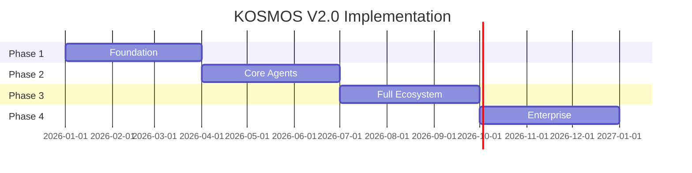

# Implementation Roadmap

Phased implementation plan for KOSMOS V2.0.

## Phase Overview

## Phase 1: Foundation (Months 1-3)

### Core Infrastructure
- PostgreSQL 16 + extensions (pgvector, Apache AGE, TimescaleDB)
- K3s cluster setup
- Zitadel authentication
- Infisical secrets management

### Basic Agent Framework
- Zeus orchestrator implementation
- BaseAgent class and interfaces
- NATS messaging integration

### Essential MCPs (12)
- mcp-postgresql
- mcp-litellm
- mcp-memory
- Core database and AI MCPs

**Milestone M1**: Infrastructure Ready (Month 1)
**Milestone M2**: Zeus Operational (Month 2)

## Phase 2: Core Agents (Months 4-6)

### Agent Implementation
- **Athena** - RAG/Knowledge agent with Context7
- **Hermes** - Communications (email, Slack, Teams)
- **AEGIS** - Security monitoring and veto power
- **Hephaestus** - DevOps and CI/CD

### Governance
- Pentarchy voting system
- Kill-switch protocol
- Audit logging

### Additional MCPs (20)
- Security MCPs (Zitadel, Falco, Prompt Armor)
- Communication MCPs (Gmail, Slack)
- DevOps MCPs (GitHub, Docker, Kubernetes)

**Milestone M3**: First 4 Agents (Month 4)
**Milestone M4**: Pentarchy Active (Month 5)

## Phase 3: Full Agent Ecosystem (Months 7-9)

### Remaining Agents
- **Chronos** - Scheduling and calendar
- **Iris** - Notifications and alerts
- **MEMORIX** - Memory and knowledge graph
- **Nur PROMETHEUS** - Analytics and insights
- **Hestia** - Personal wellness
- **Morpheus** - Learning and adaptation

### Human Factors
- Ergonomic engine (color temperature, breaks)
- Amnesia protocol (GDPR compliance)
- Red herring protocols (vigilance testing)

### Additional MCPs (30)
- Productivity MCPs
- Analytics MCPs
- External service integrations

**Milestone M5**: Full Agent Ecosystem (Month 8)

## Phase 4: Enterprise Features (Months 10-12)

### Developer Experience
- Python SDK (sync/async)
- TypeScript SDK
- Developer portal
- Interactive API documentation

### Entertainment Ecosystem
- Media management MCPs
- Content curation
- Cross-platform sync

### Training Academy
- 4-track curriculum
- Interactive tutorials
- Certification system

### Remaining MCPs (26)
- Entertainment MCPs
- Enterprise integrations
- Specialized tools

**Milestone M6**: SDK Release (Month 10)
**Milestone M7**: Enterprise Ready (Month 12)

## Milestone Tracking

| Milestone | Target | Success Criteria |
|-----------|--------|------------------|
| M1: Infrastructure Ready | Month 1 | All core services deployed |
| M2: Zeus Operational | Month 2 | Basic orchestration working |
| M3: First 4 Agents | Month 4 | Athena, Hermes, AEGIS, Hephaestus |
| M4: Pentarchy Active | Month 5 | Governance voting functional |
| M5: Full Agent Ecosystem | Month 8 | All 11 agents operational |
| M6: SDK Release | Month 10 | Python + TypeScript SDKs |
| M7: Enterprise Ready | Month 12 | All features + certifications |

## Feature Inventory

| Category | Total Features | Phase 1 | Phase 2 | Phase 3 | Phase 4 |
|----------|---------------|---------|---------|---------|---------|
| Agents | 11 | 1 | 4 | 6 | 0 |
| MCP Servers | 88 | 12 | 20 | 30 | 26 |
| Governance | 12 | 2 | 6 | 2 | 2 |
| Security | 15 | 4 | 8 | 2 | 1 |
| Infrastructure | 6 | 6 | 0 | 0 | 0 |
| Developer Tools | 7 | 0 | 1 | 2 | 4 |
| **Total** | **169** | **25** | **39** | **42** | **33** |

## Risk Mitigation

| Risk | Likelihood | Impact | Mitigation |
|------|------------|--------|------------|
| Scope creep | High | High | Strict phase gates |
| Technical complexity | High | Medium | Phased delivery |
| Integration challenges | Medium | High | Early integration testing |
| Resource constraints | Medium | High | Prioritize P0/P1 features |
| Compliance delays | Low | Critical | Parallel compliance work |

## Success Metrics

### Phase 1 Exit Criteria
- [ ] PostgreSQL with extensions operational
- [ ] K3s cluster healthy
- [ ] Zeus processing basic requests
- [ ] Authentication functional

### Phase 2 Exit Criteria
- [ ] 4 agents operational
- [ ] Pentarchy voting working
- [ ] Security veto functional
- [ ] 32 MCP servers integrated

### Phase 3 Exit Criteria
- [ ] All 11 agents operational
- [ ] 62 MCP servers integrated
- [ ] Human factors features live
- [ ] GDPR compliance verified

### Phase 4 Exit Criteria
- [ ] All 88 MCP servers integrated
- [ ] SDKs published
- [ ] Training platform live
- [ ] SOC 2 audit passed
