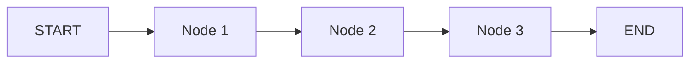

# Agent Implementation Specification Template

**Agent Name:** [Agent Name]  
**Created:** [Date]  
**Status:** Draft | Review | Approved | Implemented  
**Related ACTION_PLAN.md Tasks:** [Task references]

---

## Overview

### Agent Identity
- **Agent ID:** `[agent_id]`
- **Display Name:** [Display Name]
- **Domain:** [Domain name]
- **Description:** [Brief description of agent's purpose]

### Responsibilities
- [ ] Responsibility 1
- [ ] Responsibility 2
- [ ] Responsibility 3

### Use Cases
- Use case 1: [Description]
- Use case 2: [Description]
- Use case 3: [Description]

---

## Architecture

### Base Class
```python
class [AgentName]Agent(LangGraphAgent[[AgentName]State]):
    """Agent description."""
```

### State Model
```python
class [AgentName]State(AgentGraphState):
    """Agent-specific state."""
    # Add agent-specific fields
    field1: Optional[str] = None
    field2: Dict[str, Any] = Field(default_factory=dict)
```

### Workflow Graph


### Nodes
- **node1:** [Description]
- **node2:** [Description]
- **node3:** [Description]

### Edges
- `START → node1`: [Condition]
- `node1 → node2`: [Condition]
- `node2 → node3`: [Condition]
- `node3 → END`: [Condition]

---

## Tool Integration

### MCP Servers
- [ ] **Server 1:** [Purpose]
- [ ] **Server 2:** [Purpose]

### Tool Categories
- [ ] `ToolCategory.CATEGORY1`
- [ ] `ToolCategory.CATEGORY2`

### Tool Usage Patterns
```python
# Example tool call
result = await self.tool_registry.call_tool(
    server="server-name",
    tool="tool-name",
    params={"param1": "value1"}
)
```

---

## Human-in-the-Loop

### Approval Gates
- [ ] **Gate 1:** [When triggered, what requires approval]
- [ ] **Gate 2:** [When triggered, what requires approval]

### Input Requests
- [ ] **Input Type 1:** [When requested, what information needed]
- [ ] **Input Type 2:** [When requested, what information needed]

---

## Governance Integration

### Pentarchy Voting
- [ ] **Trigger:** [When voting is required]
- [ ] **Vote Type:** [Approval/Rejection/Modification]

### Cost Governance
- [ ] **Cost Threshold:** $[Amount]
- [ ] **Auto-approve:** Yes/No
- [ ] **Requires Approval:** [Who]

### Security Veto
- [ ] **AEGIS Review:** [When AEGIS review is triggered]
- [ ] **Veto Conditions:** [What can be vetoed]

---

## SDUI Components

### Component Generation
- [ ] **Component 1:** [When generated, what it displays]
- [ ] **Component 2:** [When generated, what it displays]

### Example SDUI Response
```json
{
  "components": [
    {
      "type": "GlassCard",
      "props": {
        "title": "Card Title",
        "content": "Card content"
      }
    }
  ]
}
```

---

## Implementation Details

### Node Implementations
```python
async def _node1(self, state: [AgentName]State) -> [AgentName]State:
    """Node 1 implementation."""
    # Implementation
    return state
```

### Error Handling
- [ ] Retry logic: [Strategy]
- [ ] Fallback behavior: [Description]
- [ ] Error reporting: [How errors are reported]

### Checkpointing
- [ ] Checkpoint frequency: [When]
- [ ] State persistence: [Where]
- [ ] Recovery: [How state is recovered]

---

## Testing Strategy

### Unit Tests
```python
@pytest.mark.asyncio
async def test_agent_node1():
    """Test node 1 functionality."""
    # Test implementation
    pass
```

### Integration Tests
- [ ] Test with MCP servers
- [ ] Test workflow execution
- [ ] Test error handling
- [ ] Test checkpointing

### E2E Tests
- [ ] Test complete workflow
- [ ] Test with real user input
- [ ] Test governance integration

---

## Performance Requirements

### Latency Targets
- **Node execution:** < [X]ms (p95)
- **Tool calls:** < [X]ms (p95)
- **Total workflow:** < [X]ms (p95)

### Throughput
- **Concurrent workflows:** [X]
- **Workflows per second:** [X]

### Resource Usage
- **Memory:** < [X]MB per workflow
- **CPU:** < [X]% per workflow

---

## Cost Analysis

### LLM Usage
- **Model:** [Model name]
- **Tokens per workflow:** [Estimate]
- **Cost per workflow:** $[Estimate]

### Tool Calls
- **MCP server calls:** [Count]
- **External API calls:** [Count]
- **Cost per workflow:** $[Estimate]

### Total Cost
- **Cost per workflow:** $[Total]
- **Daily budget:** $[Amount]
- **Monthly budget:** $[Amount]

---

## Monitoring

### Metrics
- [ ] Workflow execution count
- [ ] Success/failure rate
- [ ] Average execution time
- [ ] Cost per workflow
- [ ] Tool call success rate

### Logging
- [ ] Log level: INFO/DEBUG
- [ ] Log fields: [List]
- [ ] Audit log: Yes/No

### Alerts
- [ ] Failure rate > [X]%
- [ ] Latency > [X]ms
- [ ] Cost > [X] per hour

---

## Security

### Authentication
- [ ] User authentication required: Yes/No
- [ ] Token validation: [How]

### Authorization
- [ ] Permission checks: [What permissions]
- [ ] Tenant isolation: Yes/No

### Input Validation
- [ ] Input sanitization: [How]
- [ ] Prompt injection prevention: [How]

---

## Dependencies

### Internal
- [ ] Other agents: [List]
- [ ] Core services: [List]

### External
- [ ] MCP servers: [List]
- [ ] External APIs: [List]

---

## Rollout Plan

### Phase 1: Development
- [ ] Implementation complete
- [ ] Unit tests passing
- [ ] Integration tests passing

### Phase 2: Staging
- [ ] Deployed to staging
- [ ] End-to-end testing complete
- [ ] Performance validated

### Phase 3: Production
- [ ] Deployed to production
- [ ] Monitoring active
- [ ] Documentation updated

---

## Success Metrics

- **Metric 1:** [Target value]
- **Metric 2:** [Target value]
- **Metric 3:** [Target value]

---

## References

- [Related agent documentation]
- [Related MCP server docs]
- [Related ACTION_PLAN.md tasks]

---

**Last Updated:** [Date]  
**Updated By:** [Name]
